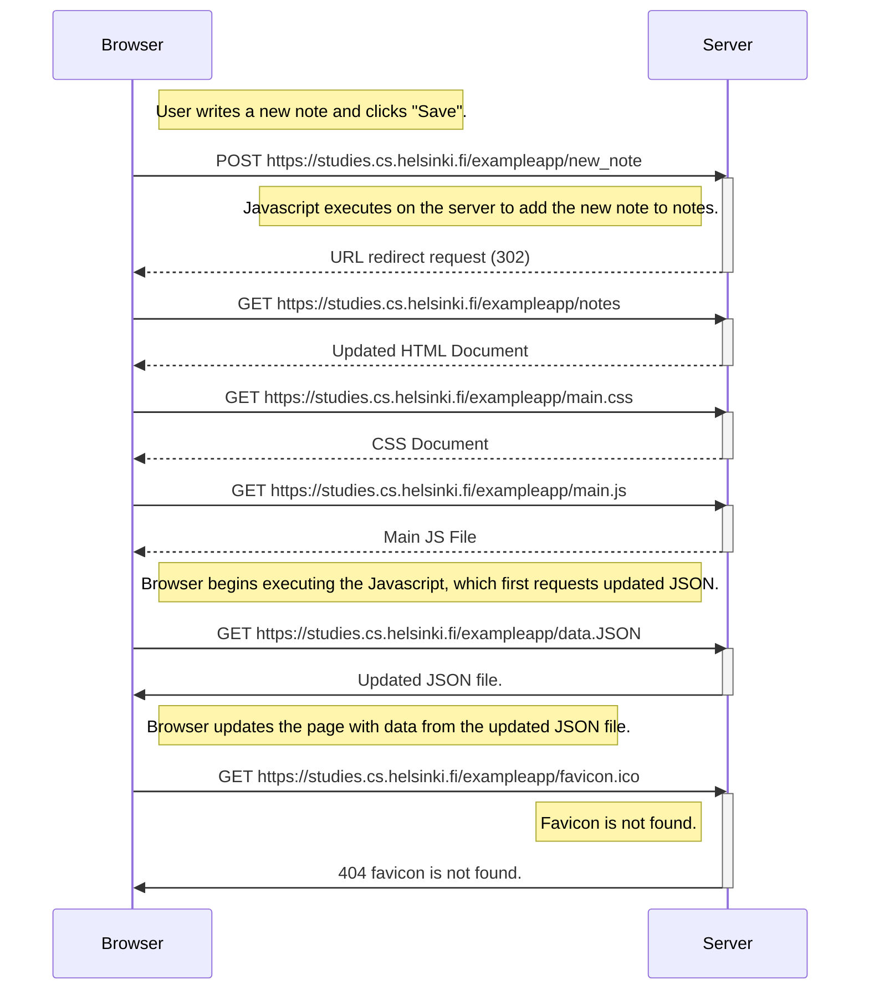

```mermaid
sequenceDiagram
    participant Browser
    participant Server

    note right of Browser: User writes a new note and clicks "Save".

    Browser->>Server: POST https://studies.cs.helsinki.fi/exampleapp/new_note
    activate Server
    note left of Server: Javascript executes on the server to add the new note to notes.
    Server-->>Browser: URL redirect request (302)
    deactivate Server

    Browser->>Server: GET https://studies.cs.helsinki.fi/exampleapp/notes
    activate Server
    Server-->>Browser: Updated HTML Document 
    deactivate Server

    Browser->>Server: GET https://studies.cs.helsinki.fi/exampleapp/main.css
    activate Server
    Server-->>Browser: CSS Document 
    deactivate Server

    Browser->>Server: GET https://studies.cs.helsinki.fi/exampleapp/main.js
    activate Server
    Server-->>Browser: Main JS File 
    deactivate Server

    note right of Browser: Browser begins executing the Javascript, which first requests updated JSON.

    Browser->>Server: GET https://studies.cs.helsinki.fi/exampleapp/data.JSON
    activate Server
    Server->>Browser: Updated JSON file.
    deactivate Server

    note right of Browser: Browser updates the page with data from the updated JSON file.

    Browser->>Server: GET https://studies.cs.helsinki.fi/exampleapp/favicon.ico
    activate Server
    note left of Server: Favicon is not found.
    Server->>Browser: 404 favicon is not found.
    deactivate Server
```
