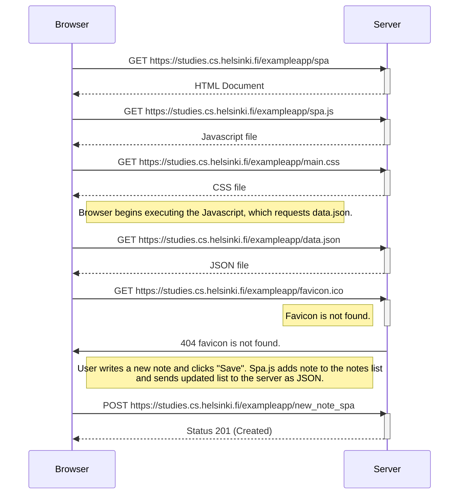

```mermaid
sequenceDiagram
    participant Browser
    participant Server
Browser->>Server: GET https://studies.cs.helsinki.fi/exampleapp/spa
activate Server
Server-->>Browser: HTML Document
deactivate Server
Browser->>Server: GET https://studies.cs.helsinki.fi/exampleapp/spa.js
activate Server
Server-->>Browser: Javascript file
deactivate Server
Browser->>Server: GET https://studies.cs.helsinki.fi/exampleapp/main.css
activate Server
Server-->>Browser: CSS file
deactivate Server
note right of Browser: Browser begins executing the Javascript, which requests data.json.
Browser->>Server: GET https://studies.cs.helsinki.fi/exampleapp/data.json
activate Server
Server-->>Browser: JSON file
deactivate Server
Browser->>Server: GET https://studies.cs.helsinki.fi/exampleapp/favicon.ico
activate Server
note left of Server: Favicon is not found.
deactivate Server
Server->>Browser: 404 favicon is not found.
note right of Browser: User writes a new note and clicks "Save". Spa.js adds note to the notes list<br/> and sends updated list to the server as JSON. 
Browser->>Server: POST https://studies.cs.helsinki.fi/exampleapp/new_note_spa
activate Server
Server-->>Browser: Status 201 (Created)
deactivate Server
``` 
