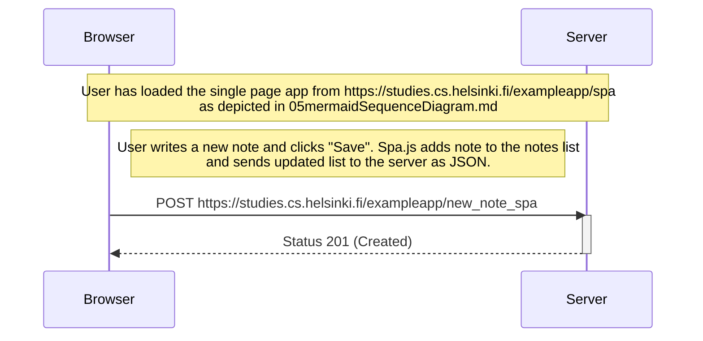

```mermaid
sequenceDiagram
    participant Browser
    participant Server

Note over Browser,Server: User has loaded the single page app from https://studies.cs.helsinki.fi/exampleapp/spa <br/>as depicted in 05mermaidSequenceDiagram.md

note right of Browser: User writes a new note and clicks "Save". Spa.js adds note to the notes list<br/> and sends updated list to the server as JSON. 

Browser->>Server: POST https://studies.cs.helsinki.fi/exampleapp/new_note_spa
activate Server
Server-->>Browser: Status 201 (Created)
deactivate Server
``` 
